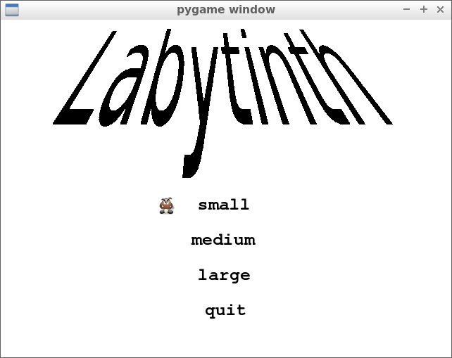
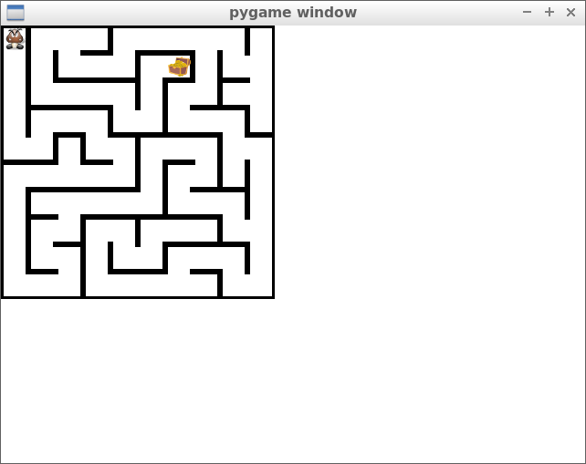
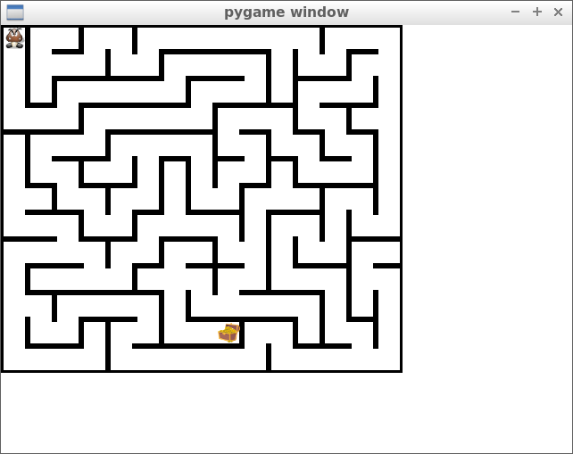
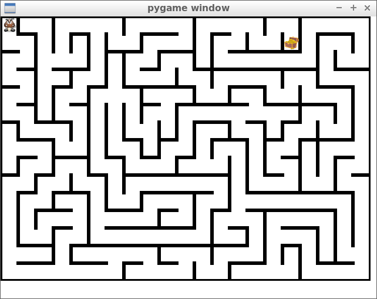
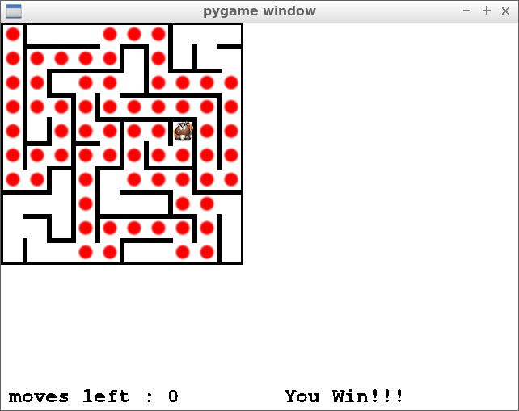

# Labyrinthe

---

## 1. Presentation

I made this Maze game to learn python and pygame.

There is 3 sizes of mazes, each is generated randomly. the Goal is to reach the treasure with the less moves (not a big challenge...). The treasure is positionned at the end of the longuest path.

## 2. Installation
clone the repo
> git clone https://github.com/Zepmanbc/labyrinth.git

go in the folder
> cd labyrinth

create a virtual environment
> virtualenv env -p python3

install requirements
> pip install -r requirements.txt

allow execution of the game
> chmod +x main.py

## 3. How to play
launch the game
> python main.py

_Title menu_

Use arrow keys tu go **up** or **down**

Select with **Enter**

In the game use the arrows to move the avatar

press **Q** if you want to go back to title menu

_Small Maze 10x10_

_Medium Maze 15x13_

_Large Maze 21x15_

When you reach the treasure, the game is over.

Red dots show you the shorter path.

## 4. Code notes

_to do..._

## 5. To do list

* Do some unit tests
* Stop the game when the treasure has been reached
* Learn that there is a 'e' at the end of labyrinthe
* add a time record
* record best times with longuest path?
* any idea for cool feature ? tell me